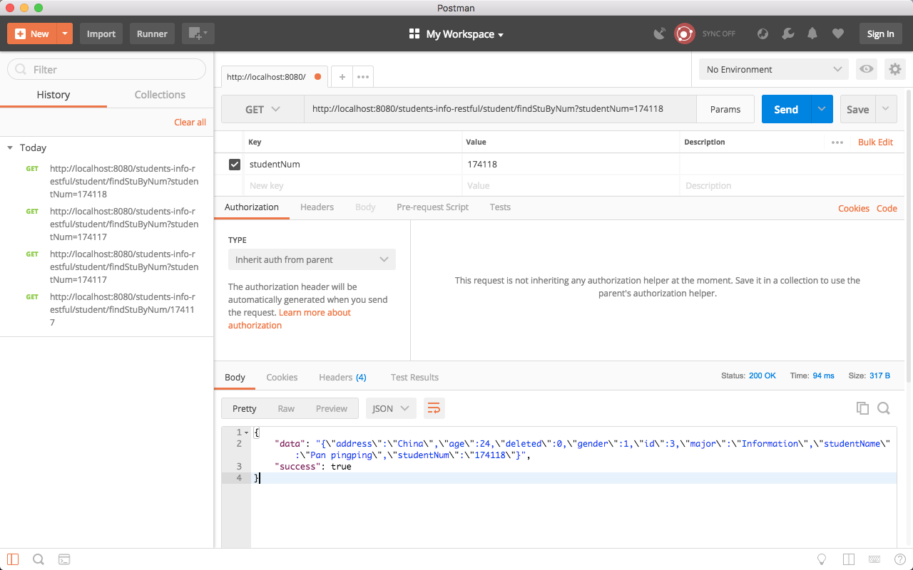
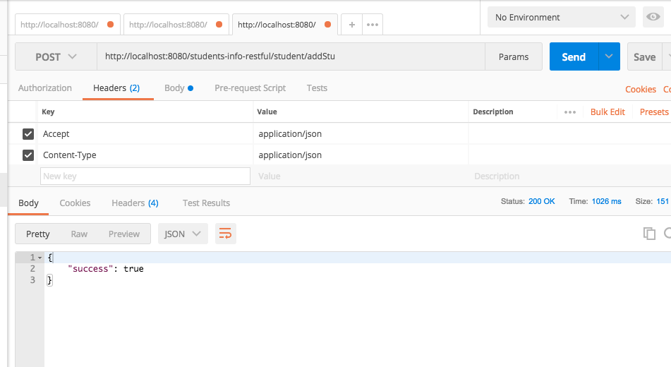
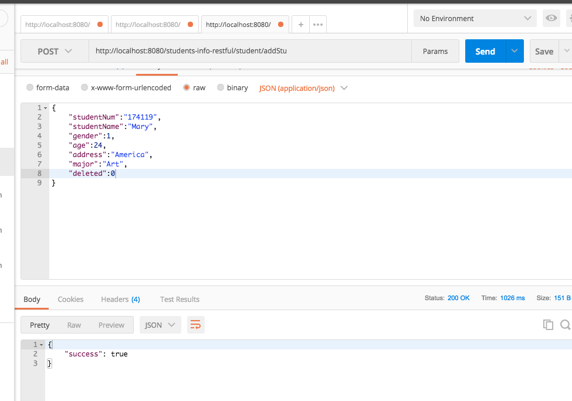
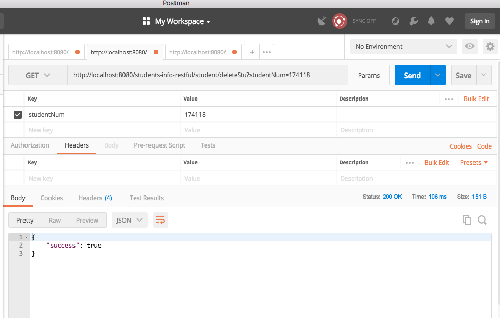

# Spring + Mybatis + CXF Restful服务

## 配置
### 1. maven项目的 pom.xml配置。
主要添加一些package： c3p0 + spring + cxf + mysql-connector 等
##### 代码:
```xml
  <properties>
    <project.build.sourceEncoding>UTF-8</project.build.sourceEncoding>
    <maven.compiler.source>1.7</maven.compiler.source>
    <maven.compiler.target>1.7</maven.compiler.target>
    <spring.version>4.3.14.RELEASE</spring.version>
    <cxf.version>3.1.11</cxf.version>
    <c3p0.version>0.9.5.2</c3p0.version>
    <mysql-connector-java.version>5.1.45</mysql-connector-java.version>
    <mybatis-spring.version>1.3.1</mybatis-spring.version>
    <mybatis.version>3.4.5</mybatis.version>
  </properties>

  <dependencies>
    <!-- c3p0 -->
    <dependency>
      <groupId>com.mchange</groupId>
      <artifactId>c3p0</artifactId>
      <version>${c3p0.version}</version>
    </dependency>

    <!-- mysql-connector -->
    <dependency>
      <groupId>mysql</groupId>
      <artifactId>mysql-connector-java</artifactId>
      <version>${mysql-connector-java.version}</version>
    </dependency>

    <!-- spring -->
    <dependency>
      <groupId>org.springframework</groupId>
      <artifactId>spring-orm</artifactId>
      <version>${spring.version}</version>
    </dependency>
    <dependency>
      <groupId>org.springframework</groupId>
      <artifactId>spring-context</artifactId>
      <version>${spring.version}</version>
    </dependency>
    <dependency>
      <groupId>org.springframework</groupId>
      <artifactId>spring-core</artifactId>
      <version>${spring.version}</version>
    </dependency>
    <dependency>
      <groupId>org.springframework</groupId>
      <artifactId>spring-web</artifactId>
      <version>${spring.version}</version>
    </dependency>
    <dependency>
      <groupId>org.springframework</groupId>
      <artifactId>spring-aop</artifactId>
      <version>${spring.version}</version>
    </dependency>
    <!-- spring end.  -->

    <!-- mybatis-spring -->
    <dependency>
      <groupId>org.mybatis</groupId>
      <artifactId>mybatis-spring</artifactId>
      <version>${mybatis-spring.version}</version>
    </dependency>
    <dependency>
      <groupId>org.mybatis</groupId>
      <artifactId>mybatis</artifactId>
      <version>${mybatis.version}</version>
    </dependency>

    <!-- cxf -->
    <dependency>
      <groupId>org.apache.cxf</groupId>
      <artifactId>cxf-rt-frontend-jaxrs</artifactId>
      <version>${cxf.version}</version>
    </dependency>
    <dependency>
      <groupId>org.apache.cxf</groupId>
      <artifactId>cxf-rt-rs-client</artifactId>
      <version>${cxf.version}</version>
    </dependency>
    <!-- cxf end. -->

    <!-- json -->
    <dependency>
      <groupId>com.alibaba</groupId>
      <artifactId>fastjson</artifactId>
      <version>1.2.41</version>
    </dependency>
    <dependency>
      <groupId>org.codehaus.jackson</groupId>
      <artifactId>jackson-jaxrs</artifactId>
      <version>1.2.1</version>
    </dependency>

    <dependency>
      <groupId>javax.ws.rs</groupId>
      <artifactId>jsr311-api</artifactId>
      <version>1.1.1</version>
    </dependency>

    <dependency>
      <groupId>javax.servlet</groupId>
      <artifactId>javax.servlet-api</artifactId>
      <version>4.0.0-b01</version>
    </dependency>

    <dependency>
      <groupId>junit</groupId>
      <artifactId>junit</artifactId>
      <version>4.12</version>
      <scope>test</scope>
    </dependency>
  </dependencies>
```

### 2. Spring 基本配置 applicatoncontext.xml
- 1.利用Spring自动扫描，创建Bean
- 2.Spring提供了Properties机制，加入项目的配置文件:students-info-restful.properties
- 3.配置c3p0数据库连接池，管理数据库连接。
- 4.Spring配置MyBatis连接数据库

##### 代码：
```xml
    <import resource="spring-cxf-restful.xml"/>
    <!-- 使用注解式注入 -->
    <context:annotation-config />
    <!-- 自动扫描 -->
    <context:component-scan base-package="org.ppp" />
    <bean class="org.springframework.beans.factory.annotation.AutowiredAnnotationBeanPostProcessor"/>

    <!--调用restful服务端-->
    <bean id="webClient" class="org.apache.cxf.jaxrs.client.WebClient" factory-method="create">
        <constructor-arg type="java.lang.String" value="http://localhost:8080/students-info-restful/" />
    </bean>

    <!-- for properties -->
    <bean id="propertyConfigurer" class="org.springframework.beans.factory.config.PropertyPlaceholderConfigurer">
        <property name="fileEncoding" value="utf-8" />
        <property name="locations">
            <list>
                <value>classpath*:students-info-restful.properties</value>
            </list>
        </property>
    </bean>

    <!-- for database -->
    <bean id="dataSource" class="com.mchange.v2.c3p0.ComboPooledDataSource"  destroy-method="close">
        <property name="driverClass" value="${students.info.db.driverClass}" />
        <property name="jdbcUrl" value="${students.info.db.url}" />
        <property name="user" value="${students.info.db.user}" />
        <property name="password" value="${students.info.db.password}" />
        <property name="initialPoolSize" value="3" />
        <property name="minPoolSize" value="2" />
        <property name="maxPoolSize" value="10" />
        <property name="maxIdleTime" value="60" />
        <property name="acquireRetryDelay" value="1000" />
        <property name="acquireRetryAttempts" value="10" />
        <property name="preferredTestQuery" value="SELECT 1" />
    </bean>

    <bean id="sqlSessionFactory" class="org.mybatis.spring.SqlSessionFactoryBean">
        <property name="dataSource" ref="dataSource" />
        <property name="mapperLocations" value="classpath:mybatis-mapper/*.xml"/>
    </bean>

    <bean class="org.mybatis.spring.mapper.MapperScannerConfigurer">
        <property name="sqlSessionFactoryBeanName" value="sqlSessionFactory"/>
        <property name="basePackage" value="org.ppp.dao" />
    </bean>
</beans>
```

### 3.Spring 整合 CXF spring-cxf-restful.xml

##### 代码:
```xml
<?xml version="1.0" encoding="UTF-8"?>
<beans xmlns="http://www.springframework.org/schema/beans"
       xmlns:xsi="http://www.w3.org/2001/XMLSchema-instance"
       xmlns:jaxrs="http://cxf.apache.org/jaxrs"
       xmlns:context="http://www.springframework.org/schema/context"
       xsi:schemaLocation="http://www.springframework.org/schema/beans
       http://www.springframework.org/schema/beans/spring-beans.xsd
       http://www.springframework.org/schema/context
       http://www.springframework.org/schema/context/spring-context.xsd
       http://cxf.apache.org/jaxrs
       http://cxf.apache.org/schemas/jaxrs.xsd">

    <!-- 使用注解式注入 -->
    <context:annotation-config />
    <!-- 自动扫描 -->
    <context:component-scan base-package="org.ppp" />

    <bean id="student" class="org.ppp.service.impl.StudentServiceImpl"></bean>
    <jaxrs:server address="/" id="StudentService">
        <jaxrs:serviceBeans>
            <ref bean="student"/>
        </jaxrs:serviceBeans>

        <jaxrs:providers>
            <bean class="org.codehaus.jackson.jaxrs.JacksonJsonProvider" />
            <bean class="org.apache.cxf.jaxrs.provider.JAXBElementProvider" />
        </jaxrs:providers>
    </jaxrs:server>

</beans>
```

## 设计
 使用分层设计模式: 
 
 - 1.设计Model层，存放实体Bean对象
 - 2.设计Service层。利用RESTFul接口
 - 3.使用MyBatis机制，设计Dao接口层
 - 4.数据库表设计时，保持不删除，使用字段deleted=1表示删除

 
### 1. model层实体类设计 Student.java
```java
package org.ppp.model;

public class Student {
    private int id;
    private String studentNum;
    private String studentName;
    private int gender;
    private int age;
    private String address;
    private String major;
    private int deleted;
    
    // getXXX(), setXXX()
}
```

### 2.1 学生服务接口 IStudentService.java
- 1.由于项目比较简单，直接省略了Controller层，设计Service层。
- 2.使用接口，帮忙后期的RPC管理和调用

```java
@Path(value = "/student")
public interface IStudentService {

    /**
     * 根据学生学号查询学生信息
     * @param studentNum 学生学号
     * @return
     */
    @GET
    @Path(value = "/findStuByNum/{studentNum}")
    @Produces(MediaType.APPLICATION_JSON)
    public String findStuByNum(@PathParam("studentNum") String  studentNum);

    /**
     * 增加一个学生信息
     * @param student 学生对象
     */
    @POST
    @Path("/addStu")
    @Produces({MediaType.APPLICATION_XML,MediaType.APPLICATION_JSON})
    public void addStu(Student student);

    /**
     * 删除一个学生信息
     * @param studentNum 学生学号
     */
    @DELETE
    @Path("/deleteStu/{studentNum}")
    public void deleteStu(@PathParam("studentNum") String studentNum);

}

```

### 2.2 学生服务实现 StudentServiceImpl.java

```java
public class StudentServiceImpl implements IStudentService {
    @Context
    private UriInfo uriInfo;

    @Context
    private Request request;

    @Resource
    private StudentDao studentDao;

    @GET
    @Path(value = "/findStuByNum/{studentNum}")
    @Produces(MediaType.APPLICATION_JSON)
    public String findStuByNum(@PathParam("studentNum") String  studentNum) {
        Student student = studentDao.findByStudentNum(studentNum);
        return JSON.toJSONString(student);
    }

    @POST
    @Path("/addStu")
    @Produces({MediaType.APPLICATION_XML,MediaType.APPLICATION_JSON})
    public void addStu(Student student) {

    }

    @DELETE
    @Path("/deleteStu/{studentNum}")
    public void deleteStu(@PathParam("studentNum") String studentNum) {

    }
}
```

### 3. MyBatis中Dao层设计

##### 代码:
```java
public interface StudentDao {
    public Student findByStudentNum(@Param("studentNum")  String studentNum);

    public void addStu(Student student);

    public void deleteStu(@Param("studentNum")  String studentNum);

}
```

### 3.1 mybatis-mapper设计

##### 代码:
```
<?xml version="1.0" encoding="UTF-8"?>
<!DOCTYPE mapper PUBLIC "-//mybatis.org//DTD Mapper 3.0//EN"
        "http://mybatis.org/dtd/mybatis-3-mapper.dtd">
<mapper namespace="org.ppp.dao.StudentDao">
    <resultMap id="Student" type="org.ppp.model.Student">
        <result column="id" property="id" />
        <result column="student_num" property="studentNum" />
        <result column="student_name" property="studentName" />
        <result column="gender" property="gender" />
        <result column="age" property="age" />
        <result column="address" property="address" />
        <result column="major" property="major" />
        <result column="deleted" property="deleted" />
    </resultMap>

    <sql id="Base_Column_List">
        t.id,
        t.student_num,
        t.student_name,
        t.gender,
        t.age,
        t.address,
        t.major,
        t.deleted
    </sql>
    
    <select id="findByStudentNum" parameterType="java.lang.String" resultMap="Student">
        SELECT <include refid="Base_Column_List" />
        FROM STUDENT AS t
        WHERE t.student_num = #{studentNum} and deleted = 0;
    </select>

    <insert id="addStu" parameterType="org.ppp.model.Student" useGeneratedKeys="true" keyProperty="id">
        INSERT INTO STUDENT ('student_num', 'student_name', 'gender', 'age', 'address', 'major', 'deleted')
        VALUES (#{studentNum}, #{studentName}, #{gender}, #{age}, #{address}, #{major}, #{deleted});
    </insert>
    
    <update id="deleteStu" parameterType="java.lang.String">
        UPDATE STUDENT As t
        SET t.deleted = 1
        WHERE t.student_num = #{studentNum};
    </update>

</mapper>
```

## 测试:
使用PostMan接口测试

### 1. 查询学生信息接口 - 测试


### 2. 添加学生接口 - 测试



### 3. 删除学生接口 - 测试
